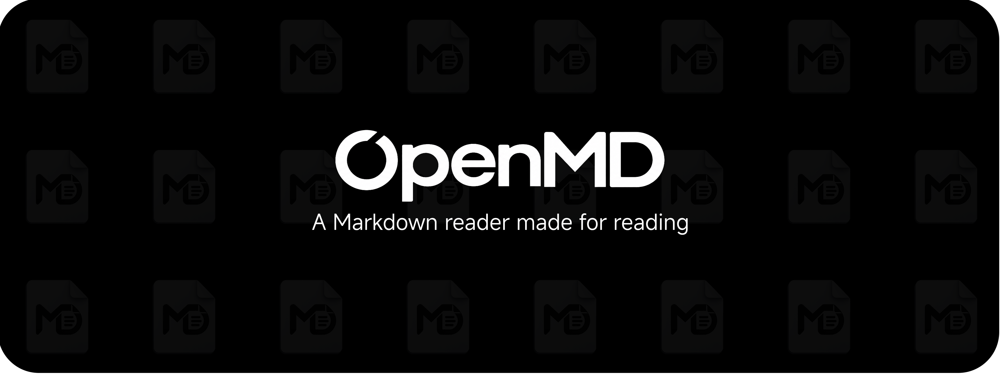

<p align="center">
  
</p>

<h1 align="center">新境盒-安卓端</h1>

<p align="center">
  <a href="https://gitcode.com/MuLiuSaMa/NexBox-Android-Update/releases">
    
  </a>
  
  
  
  
</p>

新境盒（NexBox）的安卓 App，与 [NexBox PC 端](../README.md)在同一局域网内配对，用手机查看电脑、互传文件、掌握游戏资讯。Kotlin + Jetpack Compose 原生开发，整机采用液态玻璃视觉语言。

> 本目录随主仓库分发维护，即主仓库的 `NexBox-Android/` 子目录。

## 功能总览

| 页面 | 功能 |
| --- | --- |
| **主页** | 今日人气 / 公告 / 随机一言；PC 设备互联入口（扫码配对）与文件互传 |
| **本机** | 手机硬件参数识别：SoC、GPU、内存、存储、屏幕 |
| **工具** | 悬浮框（CPU / GPU 实时状态悬浮显示）、辅助准心、网络测速、Epic 喜加一、心境 |
| **三角洲** | 每日密码、随机装备、官方地图浏览器 |
| **设置** | 主题色与外观定制、液态玻璃开关、关于与开源致谢 |

### 设备互联

-   **就近发现** — 局域网 UDP 广播自动发现 PC 端，无需手动输入 IP
-   **扫码配对** — PC 端展示二维码，手机扫码完成配对（ZXing 纯本地解码，不依赖 GMS）
-   **文件互传** — 局域网直传，双向进度实时可视
-   **当前播放同步** — 手机端实时显示 PC 正在播放的歌曲

## 系统要求

| 项目 | 要求 |
| --- | --- |
| **操作系统** | Android 8.0 及以上（液态玻璃需13.0及以上） |
| **配对设备** | 同一局域网内运行 NexBox 的 Windows 电脑 |

## 下载

前往 [GitCode 发布页](https://gitcode.com/MuLiuSaMa/NexBox-Android-Update/releases)下载最新安装包（`nexbox_android_<版本号>.apk`）。

应用内置自动更新：新版本发布后，启动时自动检查并在应用内完成下载安装。

## 从源码构建

### 前置要求

| 工具 | 版本要求 |
| --- | --- |
| **Android Studio** | 建议最新稳定版（需支持 AGP 8.13） |
| **JDK** | 17 |

### 构建步骤

```bash
# 1. 克隆主仓库
git clone https://github.com/MuLiuSaMa/NexBox.git
cd NexBox/NexBox-Android

# 2. 构建 Debug 包
./gradlew assembleDebug

# 3. 构建 Release 包（可选签名，见下文）
./gradlew assembleRelease
```

也可以直接用 Android Studio 打开 `NexBox-Android` 目录，等待 Gradle 同步完成后运行。

### 签名说明

Release 签名完全可选：在 `local.properties`（已被 .gitignore 忽略，不入库）中配置以下四项即可自动签名；缺省时产出 unsigned 包，不影响构建。

```properties
nexbox.store.file=D:/path/to/nexbox-release.p12
nexbox.store.password=证书口令
nexbox.key.alias=nexbox
nexbox.key.password=密钥口令
```

## 项目结构

```
NexBox-Android/
├── app/                          # 安卓主应用（Kotlin + Jetpack Compose）
│   └── src/main/java/com/nexbox/app/
│       ├── data/                 # 网络客户端、设备信息、配对会话等
│       ├── overlay/              # 悬浮窗服务（悬浮框 / 辅助准心）
│       ├── ui/screen/            # 各页面
│       └── update/               # 应用内更新（GitCode Releases）
├── backdrop/                     # 液态玻璃库（vendor 自 Kyant0/AndroidLiquidGlass 源码）
├── tools/                        # 数据转换脚本
└── gradle/                       # Gradle Wrapper
```

## 技术栈

-   Kotlin 2.4 + Jetpack Compose（Material 3，BOM 2025.05）
-   AndroidLiquidGlass backdrop — 液态玻璃折射 / 模糊 / 高光（vendor 源码本地编译，Maven 包与本项目工具链不兼容）
-   OkHttp + kotlinx.serialization — REST 与 WebSocket 通信
-   Coil 3 — 图片加载
-   DataStore — 本地持久化
-   ZXing Android Embedded — 扫码配对（纯本地解码，无 GMS 依赖）

## 致谢

-   [AndroidLiquidGlass](https://github.com/Kyant0/AndroidLiquidGlass) — 液态玻璃 backdrop 模块源码
-   [miuix](https://github.com/compose-miuix-ui/miuix) — Compose Multiplatform UI 组件库
-   [ZXing Android Embedded](https://github.com/journeyapps/zxing-android-embedded)、[Coil](https://github.com/coil-kt/coil)

## 许可证

本项目采用 [GPL-3.0](../LICENSE) 许可证，与主仓库一致。
