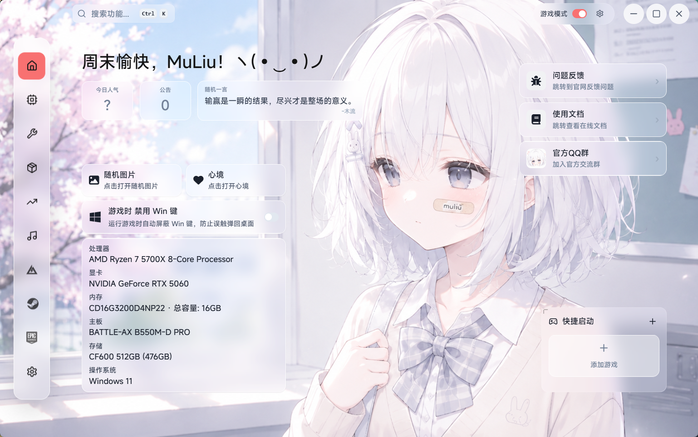
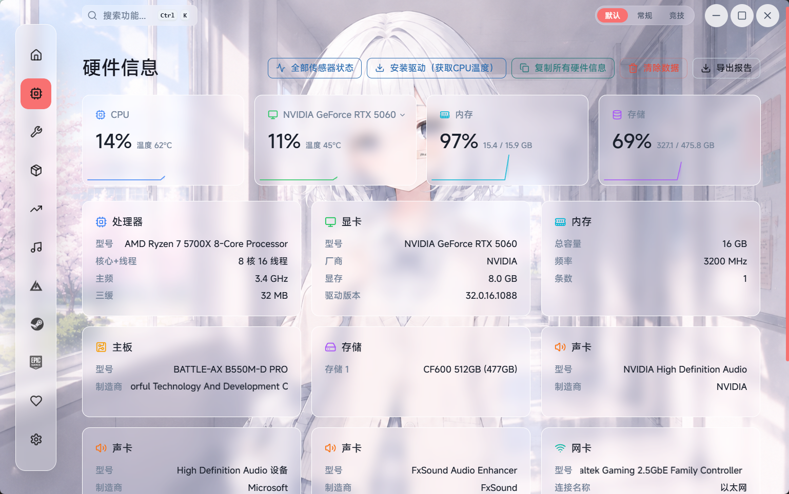
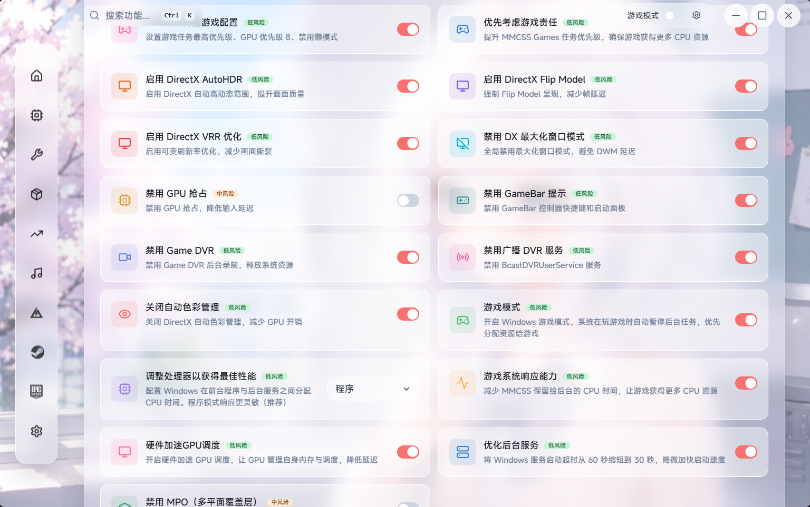
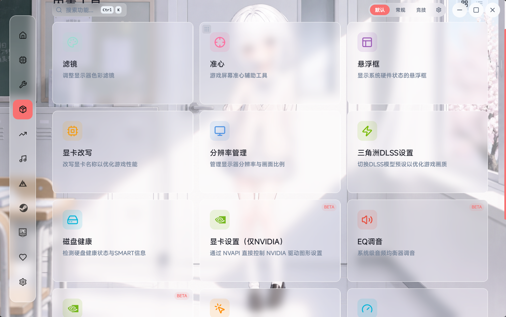

<p align="center">
  
</p>

<h1 align="center">NexBox <sub>新境盒</sub></h1>

<p align="center">
  <a href="https://github.com/MuLiuSaMa/NexBox/releases">
    
  </a>
  <a href="https://github.com/MuLiuSaMa/NexBox">
    
  </a>
  
  
  
  
</p>

<p align="center">
  <a href="https://github.com/MuLiuSaMa/NexBox"></a>
  <a href="https://gitee.com/muliuawa/nexbox"></a>
  <a href="https://gitcode.com/MuLiuSaMa/nexbox"></a>
</p>

<p align="center">
  🌐 <a href="https://nexbox.cn"><strong>nexbox.cn</strong></a>
</p>

<p align="center">
  <strong>为 PC 游戏玩家打造的一站式性能工具箱</strong><br />
  🖥️ 硬件监控 · ⚡ 系统优化 · 🎨 显示增强 · 🎮 游戏辅助 · 🎵 影音娱乐
</p>

***

<p align="center">
  <a href="#-首页">
    
  </a>
</p>

***

## 目录

- [🚀 核心亮点](#-核心亮点)
- [📸 界面预览](#-界面预览)
- [🧩 核心功能](#-核心功能)
  - [硬件监控](#硬件监控)
  - [系统优化](#系统优化)
  - [显示增强](#显示增强)
  - [游戏辅助](#游戏辅助)
  - [影音娱乐](#影音娱乐)
  - [工具集成](#工具集成)
  - [更多功能](#更多功能)
- [📦 安装](#-安装)
- [🔨 从源码构建](#-从源码构建)
- [🗂️ 项目结构](#️-项目结构)
- [🧰 技术栈](#-技术栈)
- [🤝 贡献指南](#-贡献指南)
- [📄 许可证](#-许可证)

***

## 🚀 核心亮点

PC 玩家在游戏中常常需要**同时运行七八个工具软件**——看帧率需要 MSI Afterburner、调色彩需要 DisplayCAL、清内存需要 Mem Reduct……安装繁琐、切换低效，部分工具还会被反作弊系统误判。

**NexBox 把这一切装进一个盒子。**

| ✨ 亮点 | 说明 |
| --- | --- |
| 🪶 **零性能干扰** | 基于 Tauri v2 构建，内存占用极低，游戏时近乎零开销 |
| 🔒 **纯本地运行** | 核心功能无需联网，不上传任何隐私数据 |
| 💚 **完全免费开源** | GPL-3.0 协议，代码透明可审计 |
| 🔄 **持续迭代** | 社区驱动，功能随玩家需求不断进化 |

***

## 📸 界面预览

| | |
| :---: | :---: |
| <a href="docs/screenshots/hardware.png"></a><br/>🖥️ 硬件监控 | <a href="docs/screenshots/system-optimize.png"></a><br/>⚡ 系统优化 |
| <a href="docs/screenshots/toolbox.png"></a><br/>🧰 内置工具 | <a href="docs/screenshots/steam-library.png"></a><br/>🎮 Steam 库管理 |
| <a href="docs/screenshots/music-player.png"></a><br/>🎵 音乐播放器 | <a href="docs/screenshots/home.png"></a><br/>🏠 首页 |

***

## 🧩 核心功能

### 🖥️ 硬件监控

实时监测系统硬件运行状态，支持游戏内叠加显示与独立传感器监控窗口（基于 LibreHardwareMonitorLib）。

| 监控项 | 详情 |
| --- | --- |
| **CPU** | 使用率、温度、频率、电压、功耗、核心拓扑 |
| **GPU** | 使用率、温度、风扇转速、功耗、频率、显存用量、驱动版本 |
| **内存** | 物理内存 / 虚拟内存用量、工作集大小 |
| **磁盘** | 各分区已用 / 总量、SMART 健康状态、接口类型 |
| **主板** | 型号识别、BIOS 版本、芯片组信息 |
| **显示器** | 分辨率、刷新率、型号、生产商 |
| **FPS** | 实时帧率采集、游戏内叠加显示 |
| **网络** | 适配器类型、MAC 地址、链路速率、游戏延迟 |

> 支持多 GPU 同时显示、迷你趋势图、硬件报告导出（TXT / JSON），并提供独立窗口展示全部传感器原始数据（按硬件类型分组、搜索筛选、实时刷新）。

***

### ⚡ 系统优化

20+ 项系统级优化工具，一键释放游戏性能。

- **内存清理** — 释放物理内存与工作集，支持定时自动清理（时间间隔 / 阈值触发）
- **内存限制** — 设置页面文件上限，防止虚拟内存膨胀（预设 / 自定义）
- **ACE 优化** — 优化腾讯反作弊引擎进程优先级与 CPU 亲和性，支持自动后台检测
- **CPU 核心调度** — 为进程分配 P 核 / E 核，保存调度规则，一键恢复默认
- **游戏进程优化** — 一键优化游戏进程优先级、亲和性与系统资源分配
- **磁盘碎片整理 / TRIM** — 机械盘碎片整理与固态盘 TRIM 优化
- **着色器缓存清理** — NVIDIA / AMD 双平台支持
- **电源管理** — 内置多套定制高性能电源方案，一键导入激活
- **启动项管理** — 扫描并清理注册表与启动文件夹中的自启项，支持开机最小化启动
- **网络优化器** — 多套 DNS 预设（114 / 阿里 / Cloudflare / 腾讯），TCP 参数调优
- **外设优化** — 鼠标 / 键盘 USB 轮询率调节
- **存储清理** — 系统临时文件、缓存、日志智能扫描与清理
- **系统优化器** — 6 大类共计 50+ 项 Windows 深度调整（性能 / 隐私 / 网络 / 游戏 / 触控 / 应用），含 Windows Defender 优化项
- **Windows 更新管理** — 暂停更新、禁用自动更新、屏蔽驱动更新
- **NVIDIA 驱动管理** — 驱动版本检测、新版本下载、一键安装
- **磁盘健康检测** — SMART 信息读取、健康状态评估、温度监控
- **运行时修复** — 一键修复 VC++ 运行库、DirectX 等游戏运行环境
- **VT-x 虚拟化** — 虚拟化状态检测与一键开关
- **网速测试** — 内置带宽 / 延迟测速

***

### 🎨 显示增强

- **显示滤镜** — 屏幕色彩调节：色温、亮度、对比度、饱和度独立控制；RGB 伽马通道微调；ICC 配置文件管理；多显示器独立调校；自定义滤镜预设
- **准星叠加** — 自定义游戏辅助准心：十字 / 圆点 / 圆形等 6 种样式；支持自定义 PNG 图片；职业选手预设准星（donk、s1mple、ropz 等）；颜色取色器
- **叠加面板** — 游戏内悬浮硬件信息面板：FPS / CPU / GPU / 内存 / 三角洲密码 / 游戏延迟等指标自由拖拽排序；支持灵动岛 / 竖排面板 / 默认三种样式
- **悬浮导航框** — 屏幕顶部信息栏，显示 CPU / GPU / 内存占用，始终置顶
- **垂直叠加面板** — 独立竖排信息面板，适合副屏或侧边放置

***

### 🎮 游戏辅助

- **Delta Force 专区**
  - **改枪码平台** — 分类浏览、关键词搜索、一键复制代码、点赞互动、提交分享
  - **每日密码** — 从游戏内存读取每日密码，一键复制
  - **DLSS 预设管理** — 切换 DLSS 神经网络模型预设（A-M 模型），覆盖质量级别
  - **快捷跳转** — 码枪堂、ANXU、主播改枪码、小涛查等外部平台
  - **官方地图工具** — 物资点、出生点、撤离点及首领坐标
  - **官方壁纸** — 三角洲行动高清壁纸下载
- **游戏启动器** — 自定义添加游戏，一键启动
- **Steam 管理** — 游戏库浏览、已安装游戏管理、多账户切换、直接启动游戏
- **Epic 免费游戏** — 卡片展示、限免倒计时、一键跳转领取
- **音频均衡器** — 10 段均衡器调节，内置多种预设，频谱可视化，混响效果
- **自动点击器** — 自定义点击频率与热键，自动化重复操作
- **显卡改写** — 修改注册表 GPU 名称展示（纯娱乐功能）
- **分辨率转换器** — 不同分辨率与宽高比之间的快速换算参考

***

### 🎵 影音娱乐

- **音乐播放器** — 内置网易云音乐 / 酷狗音乐双平台支持：
  - 歌单浏览、歌曲搜索、播放控制
  - 歌词显示（卡拉 OK 逐字滚动）
  - 桌面歌词叠加 — 歌词显示在桌面任意位置，支持自定义样式
  - 迷你音乐播放器 — 紧凑模式，不占屏幕空间
  - 音乐登录 — 支持平台账号登录以获取完整歌单
- **桌面歌词** — 独立窗口歌词显示，支持字体、颜色、大小、位置自定义
- **歌曲频谱** — 实时音频频谱可视化

***

### 🧰 工具集成

内置常用工具管理器，一键检测安装状态并启动：

- MSI Afterburner、CPU-Z、GPU-Z、Process Lasso、FxSound
- 火绒安全、Geek 卸载、Optimizer、Mem Reduct
- OBS Studio、Wallpaper Engine 等

***

### ✨ 更多功能

- **主题定制** — 深色 / 浅色模式、自定义主题色、毛玻璃效果、视频壁纸
- **全局热键** — 准星叠加、叠加面板、显示滤镜均支持自定义快捷键
- **系统托盘** — 最小化到托盘，自定义关闭行为，托盘菜单独立配置
- **公告系统** — 内置公告推送与重要通知弹窗
- **今日人气 / 一言** — 主页展示今日人气数据与随机名言
- **启动画面** — 定制启动加载动画
- **赞助支持** — 扫码赞助开发者
- **自动更新** — 启动时自动检查版本，应用内下载安装
- **多语言支持** — 简体中文、繁體中文、English、Français、日本語、Deutsch

***

## 📦 安装

### 系统要求

| 项目 | 要求 |
| --- | --- |
| **操作系统** | Windows 10 22H2 或更高版本（仅 64 位） |
| **内存** | 建议 4 GB 以上 |
| **磁盘** | 至少 200 MB 可用空间 |

### 下载

前往 [GitHub Releases](https://github.com/MuLiuSaMa/NexBox/releases)（或 [GitCode](https://gitcode.com/MuLiuSaMa/nexbox) / [Gitee](https://gitee.com/muliuawa/nexbox) 发布页）下载最新版安装程序，运行后按提示完成安装。

***

## 🔨 从源码构建

### 前置要求

| 工具 | 版本要求 |
| --- | --- |
| **Node.js** | >= 18.x（建议 20+） |
| **Rust** | >= 1.77.2 |
| **Visual Studio Build Tools** | Windows 专用（C++ 桌面开发工作负载） |

### 构建步骤

```bash
# 1. 克隆仓库
git clone https://github.com/MuLiuSaMa/NexBox.git
cd NexBox

# 2. 安装前端依赖
npm install

# 3. 启动开发模式（带热重载）
npm run tauri:dev

# 4. 构建生产版本
npm run tauri:build
```

构建产物位于 `src-tauri/target/release/`，安装程序由 `installer/`（Tauri 安装器工程）负责生成。

### 可用命令

| 命令 | 说明 |
| --- | --- |
| `npm run dev` | 启动 Vite 前端开发服务器 |
| `npm run tauri:dev` | 启动完整 Tauri 开发环境 |
| `npm run build` | TypeScript 检查 + Vite 构建 |
| `npm run tauri:build` | 构建 Tauri 桌面应用 |
| `npm run preview` | 预览 Vite 构建产物 |
| `npm run lint` | ESLint 代码检查 |
| `npm run format` | Prettier 代码格式化 |

***

## 🗂️ 项目结构

```
nexbox/
├── src/                          # React 前端源码
│   ├── pages/                    # 页面组件（46 个功能页面 / 面板）
│   ├── components/               # 可复用 UI 组件
│   ├── contexts/                 # React Context 状态管理
│   ├── hooks/                    # 自定义 Hooks
│   ├── stores/                   # Zustand 状态存储
│   ├── lib/                      # 工具函数与常量
│   ├── locales/                  # 国际化语言包（6 语言）
│   ├── assets/                   # 静态资源
│   ├── config/                   # 前端配置
│   └── types/                    # TypeScript 类型定义
├── src-tauri/                    # Tauri + Rust 后端
│   ├── src/                      # Rust 源码（硬件监控、系统优化等）
│   │   ├── music_api/            # 音乐平台 API（网易云 / 酷狗）
│   │   └── utils/                # 工具模块
│   ├── resources/                # 打包资源
│   ├── Cargo.toml                # Rust 依赖清单
│   └── tauri.conf.json           # Tauri 应用配置
├── installer/                    # 安装程序（React + Tauri）
├── uninstaller/                  # 卸载程序（React + Tauri）
├── monitor/                      # 硬件监控辅助程序（C# + LibreHardwareMonitorLib）
├── power-plans/                  # 定制电源计划文件（.pow）
├── aq_registry/                  # 系统优化注册表脚本
├── aq_registry_restore/          # 注册表恢复脚本
├── R560-developer/               # NVIDIA NVAPI SDK
├── docs/screenshots/             # 文档截图
├── public/                       # 前端公共资源
├── .github/workflows/            # CI（lint + build + cargo check）
└── package.json                  # Node.js 项目配置
```

***

## 🧰 技术栈

**前端**

- React 19 + TypeScript 5.8
- Vite 6（构建工具）
- Chakra UI 2 + Emotion（UI 组件）
- Zustand（状态管理）
- React Router 7（路由）
- i18next（国际化）
- Framer Motion（动画）
- DnD Kit（拖拽排序）
- three.js（3D 渲染）

**后端**

- Tauri 2.10（桌面框架）
- Rust 1.77.2
- NVML Wrapper（NVIDIA GPU 监控）
- WMI / sysinfo（Windows 硬件信息）
- LibreHardwareMonitorLib（C# 监控辅助进程）
- Axum + Tower（嵌入式 HTTP 服务）
- Tokio + reqwest（异步运行时与网络）
- windows-sys / winreg（Windows 深度集成：注册表、系统服务、蓝牙等）

**工程化**

- GitHub Actions CI — 前端 lint / build + Rust cargo check
- Husky + Prettier + ESLint — 提交前代码检查与格式化

***

## 🤝 贡献指南

欢迎以任何形式参与贡献！

1. Fork 本仓库
2. 创建特性分支：`git checkout -b feature/amazing-feature`
3. 提交更改：`git commit -m 'feat: add amazing feature'`
4. 推送分支：`git push origin feature/amazing-feature`
5. 发起 Pull Request

提交前请确保代码通过 lint 检查（CI 也会自动执行）：

```bash
npm run lint && npm run format
```

***

## 📄 许可证

本项目采用 [GPL-3.0](LICENSE) 许可证。

***

<p align="center">
  <sub>Made with ❤️ by <a href="https://github.com/MuLiuSaMa">MuLiu_SaMa</a> & the NexBox community · 官网：<a href="https://nexbox.cn">nexbox.cn</a></sub>
</p>